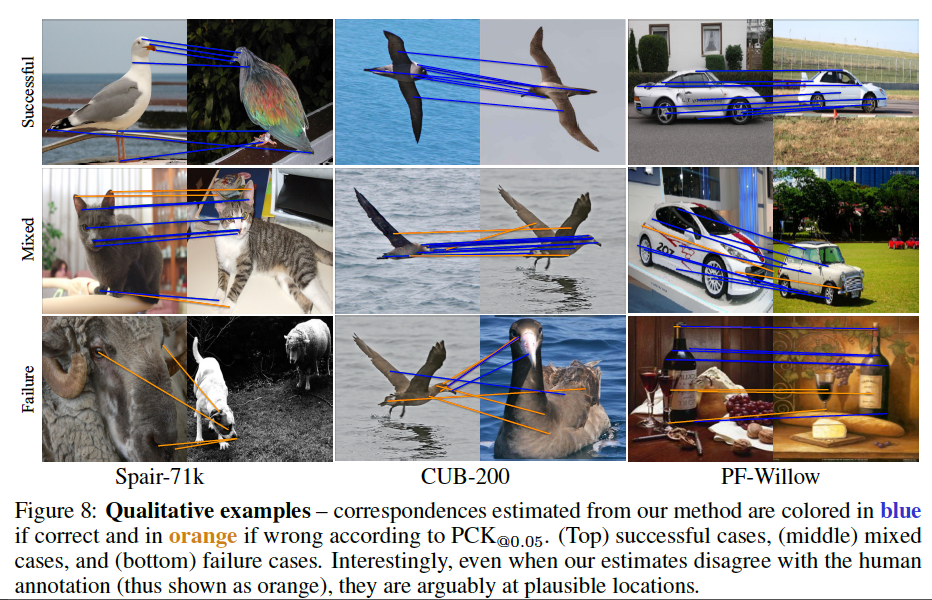

# Unsupervised Semantic Correspondence Using Stable Diffusion

[Paper](https://arxiv.org/abs/2305.15581)

This repository contains the implementation of our method for estimating correspondences with Stable Diffusion in an unsupervised manner. Our new method surpasses weakly supervised methods and closes the gap to strongly supervised methods. 

## Method Overview

We supervise the attention maps corresponding to randomly initialized text embedding to activate in a source region. This text embedding can then be applied to any target image where we simply look for the argmax in its attention map.

[](https://youtu.be/br2zX9XkWX0)

We are motivated by the fact that the attention maps for specific words act as pseudo-segmentation for those regions. By inputting an image instead of random noise we can use Stable Diffusion for inference tasks.


We find that even when our method predicts incorrect correspondences, the regions it predicts still seem reasonable. On the bottom right, of note, even though all points are meant to correspond with the wine bottle, points occluded by the wine glass instead map to the wine glass.



Our method outperforms weakly supervised methods and in the case of PF-Willow, is on par with strongly supervised methods.


We also find that when we look for correspondences between different classes, it still estimates plausible correspondences.


## Getting Started

Here are instructions on how to run the repository:

1. Install dependencies: This project uses a conda environment for managing dependencies. You can create the environment and install all dependencies with the following command:
    ```
    conda env create -f environment.yml
    ```
2. Run the evaluation script:
    ```
    conda activate keypoint_correspondences_ldm
    python3 -m eval.eval
    ```

## Visualizing Attention Maps

Here are instructions on how to visualize the repository:

1. Run the evaluation script while collecting visualizations:
    ```
    conda activate keypoint_correspondences_ldm
    python3 -m eval.eval --visualize
    ```
2. Run visualization script:
    ```
    python3 -m clickable_lines.app
    ```
